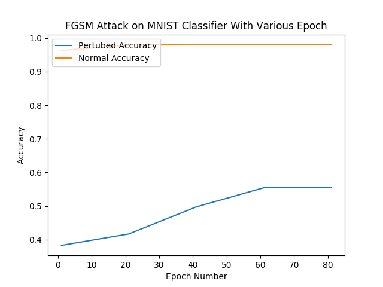
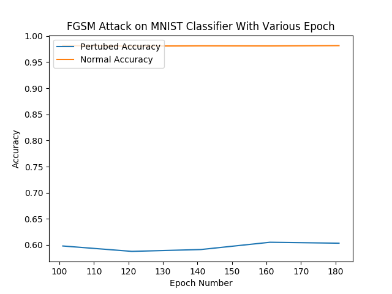

# Resisting Adversarial Attacks Against Neural Networks

In this project, we explored the effect of overfitting and regularization on a simple MNIST classifier's robustness against the Fast Gradient Sign Method (FGSM) attack. We averaged the results from 5 classifiers trained under the same set of hyperparameters to decrease noise. The code used for this experiemnt can be found in ./new.

Here are the major results and interesting observations from our experiment:
1. For a certain set of hyperparameters used for classifying the MNIST dataset, overfitting leads to more robust classifier in the beginning. Later as we overfit the classifier more, the robustness for the neural network stabilizes. The graphs demonstrate the relationship between the number of epochs and perturbed accuracy under an FGSM attack with epsilon = 0.05. We know that overfitting starts occurring before the 25th epoch by observing the train and validation losses.

2. General regularization techniques, such as L2 regularziation, which are normally used to reduce the effect of overfitting, can increase a classifier's robustness to FGSM attack as well. 

3. The FGSM attack results as a robustness measurement can be misleading. For example, in one of our very overfitted classifier, there are many 0 elements in our gradient, causing FGSM to stop attacking, leading to a false impression of a "more robust classifier". This has the same effects as gradient masking. However, the classifiers from (1) did not suffer from this effect.

## Step 1: Set up a baseline classifier

We developed a simple 3 layer vanilla classifier for the MNIST data set. The number of neurons in each layer are 200, 300 and 10.

## Step 2: reproduce the fast gradient sign attack algorithm

We reproduced a fast gradient sign attack algorithm that preprocesses images from test data, with the goal of causing the classifier to misclassify.

## Step 3: Figure out a robustness measurement
We look at the accuracy for perturbed examples vs epsilon used in the FGSM attack to analyze the robustness of the neural network.

## Step 4: Analyze how robustness changes as we overfit the classifier or use regularization techniques.
1. Using different regularization techniques - the neural net becomes MORE resistant to adversarial attacks.
2. Increase the epoch number used in training to overfit the classifier - the neural net becomes MORE resistant to adversarial attacks.

## Step 5: Develop a theory on what are the causes on why DNNs susceptible to adversarial examples

## Authors
* **Summer Yue** 
* **Sangdon Park** 
